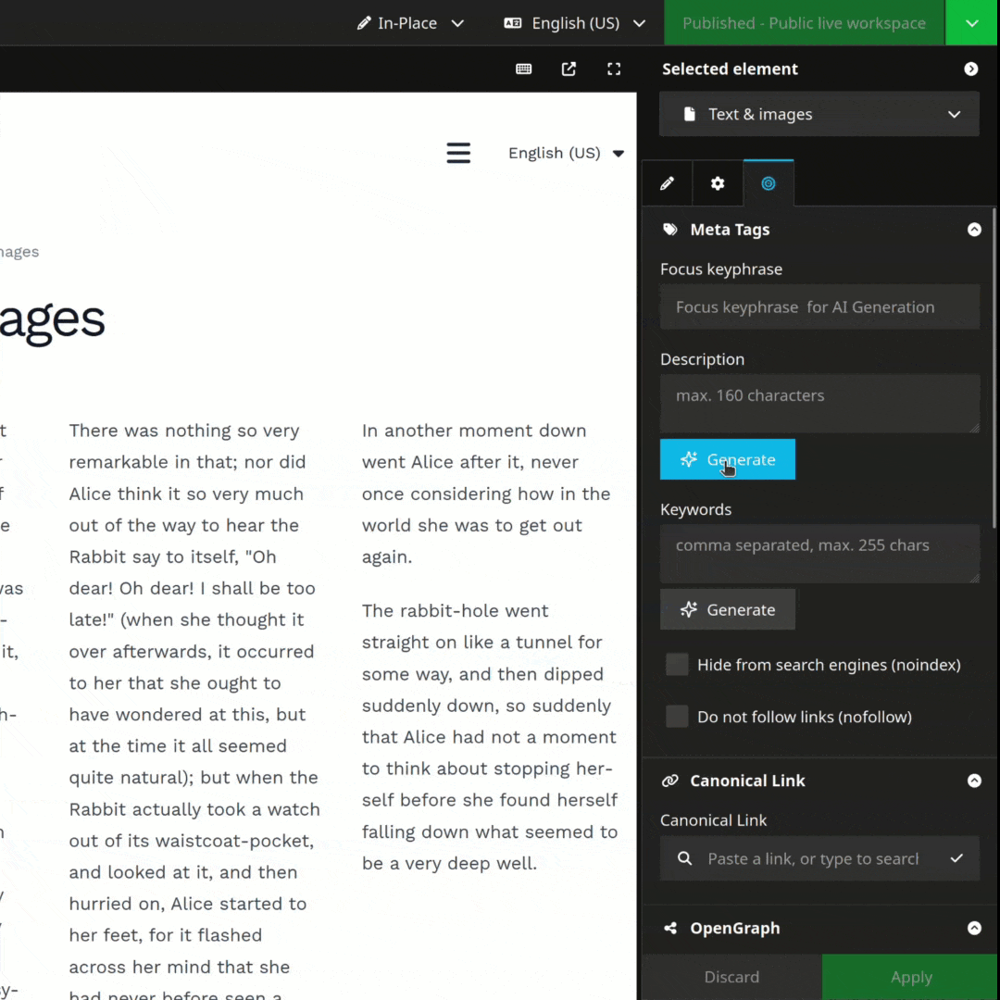
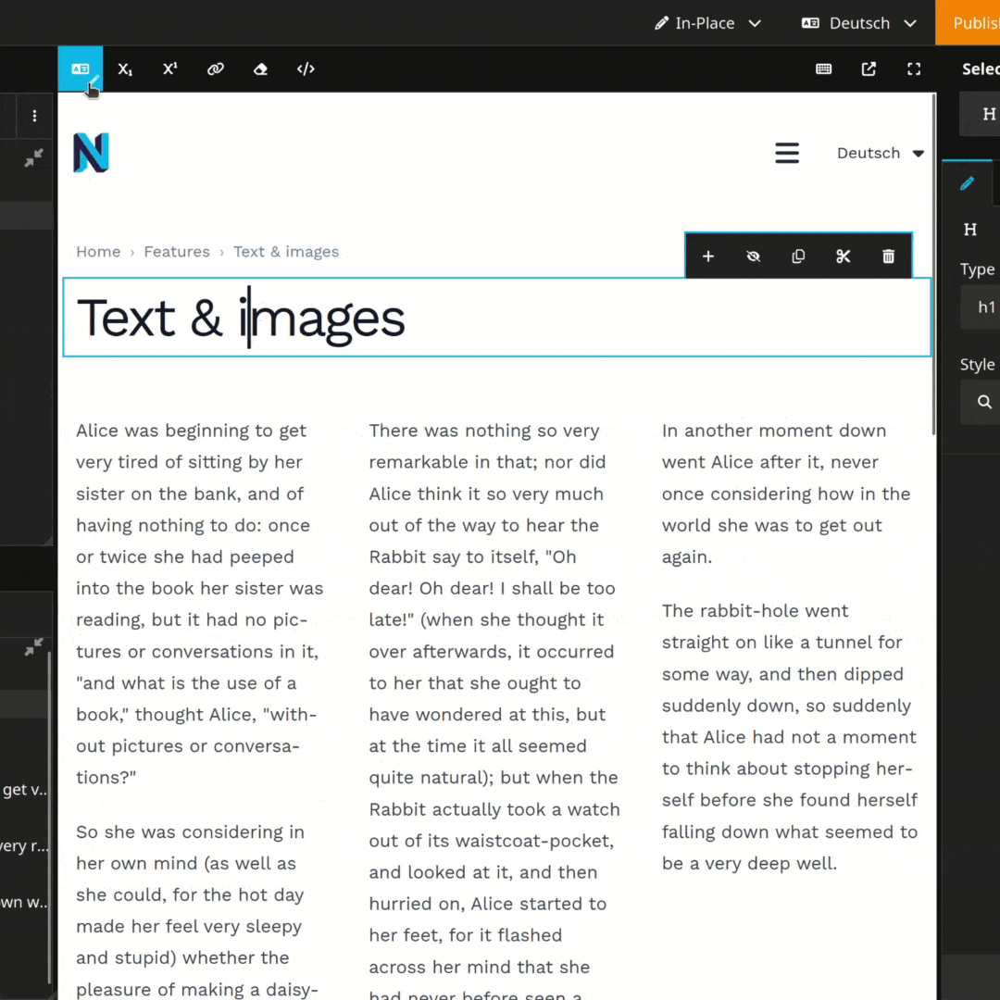

# JvMTECH.AIToolkit Package for Neos CMS
[](https://packagist.org/packages/jvmtech/ai-toolkit)
[](https://packagist.org/packages/jvmtech/ai-toolkit)

> Foundation for easy AI integration in Neos CMS
> Extensible and ready to go with SEO Meta-Description, Image Alt-Text generation Mixins and In-Place text translation

- Easy AI text generation configuration on properties in NodeType YAML files
- One-Click text translation in In-Place Editor
- Full control over prompts
- Easily extensible with custom AI model-handlers and -connectors
- Suitable for all properties with inspector editors of type TextFieldEditor and TextAreaEditor

| SEO Text Generation | In-Place Text Translation |
|---------------------|---------------------------|
| [](Documentation/jvmtech-aitoolkit-seo-text-generation.webm) | [](Documentation/jvmtech-aitoolkit-inplace-text-translation.webm) |

## Installation

```
composer require jvmtech/ai-toolkit
```

```yaml
JvMTECH:
  AIToolkit:
    modelPresets:
      gemini:
        apiKey: 'my-gemini-api-key'
```

## NodeType Configuration Contcept

- First we have to change to an AI ready Editor to be able to use the AI functionality.

  ```yaml
  properties:
    summary:
      ui:
        inspector:
          editor: 'JvMTECH.AIToolkit/TextAreaEditor'
          editorOptions: [...]
  ```
- By choosing a "**Model Handler**" we define what kind of job has to be done and by choosing a "**Model Preset**" we define with which AI model we want to process it.

  ```yaml
  modelHandler: 'textToText'
  modelPreset: 'gemini'
  ```
- By defining the "**Prompt Variables**" values we prepare the data which can be used by the AI model - in the "Prompt" but also directly in the request to the AI model.

  ```yaml
  promptVariables:
    type: "${Neos.Node.labelForNode(documentNode)}"
    content: "${documentBody}"
  ```
- By writing the "**Prompt Template**" we give instructions to the AI model on what we want to achieve.

  ```yaml
  promptTemplate: 'Create a short {type} summary of: {content}'
  ```

This way we have full flexibility and control over the AI model and the data we want to process.

## Examples

### Playing with Meta-Description
```yaml
# Use default configuration:
'Vendor:Page.Document':
  superTypes:
    'JvMTECH.AIToolkit:Mixin.SEO': true

# Or customize the AI model and prompt ("ADDITIONAL SPECIFICATIONS" are added to the default prompt):
'Vendor:Product.Document':
  superTypes:
    'JvMTECH.AIToolkit:Mixin.SEO': true
  properties:
    metaDescription:
      ui:
        inspector:
          editorOptions:
            promptTemplate: |
              # ROLE
              You are an expert SEO copywriter specializing in meta descriptions that drive clicks and improve search rankings.

              # TASK
              Create a compelling SEO meta description for the content provided below.

              # SPECIFICATIONS
              - Length: Maximum 160 characters (including spaces)
              - Style: Compelling, action-oriented, using active voice
              - Content: Must accurately represent the source material
              - Focus Keyphrase: Use "{node.properties.aiToolkitMetaFocusKeyphrase}" if available; otherwise use "{node.properties.title}"
              - Language: Write in {targetLanguage}

              # ADDITIONAL SPECIFICATIONS
              - Fun: Always use multiple Emojis

              # FORMAT REQUIREMENTS
              Deliver the meta description as plain text only.
              Do not include HTML tags, Markdown formatting, quotes, or explanatory notes.
              Provide only the final meta description text.

              # SOURCE CONTENT
              {content}
```

### Image Alt-Text generation
```yaml
# Enable image alt-text generation
'Vendor:Image.Content':
  superTypes:
    'JvMTECH.AIToolkit:Mixin.ImageAlternativeText': true
    # We assume the image is in a property named "asset"

# Or do your own thing:
'Vendor:SpecialImage.Content':
  properties:
    # specialImage: ...
    specialAlternativeText:
      options:
        preset: 'image.alternativeText'
      ui:
        inspector:
          editor: 'JvMTECH.AIToolkit/TextAreaEditor'
          editorOptions:
            modelHandler: 'imageToText'
            modelPreset: 'openai-advanced'
            promptVariables:
              targetLanguage: "${Configuration.setting('Neos.ContentRepository.contentDimensions.language.presets.' + node.context.targetDimensions.language + '.label')}"
              # The "imageToText" model handler requires the prompt variable "asset" to attach the image to the AI model request.
              asset: "${transientValues.specialImage ? transientValues.specialImage : q(node).property('specialImage')}"
            promptTemplate: |
              You are creating content for an accessible website.
              Describe the content of the attached image in a {targetLanguage} short sentence.
```

### Disabling In-Place Translation
```yaml
JvMTECH:
  AIToolkit:
    Toolbar:
      translation: ~
```

## Extensibility

### Model Handlers

Model Handlers are responsible for the communication with the AI model. They allow you to manipulate the input and output of the AI model.

The package comes with the following handlers:
- TextToText
- ImageToText

#### Custom Model Handlers

```yaml
JvMTECH:
  AIToolkit:
    modelHandlers:

      customTextToText:
        className: 'Vendor\Name\ModelHandlers\CustomTextToTextModelHandler'
        # ... optional configuration
```

### Model Connectors

Model Connectors are responsible for the actual requests to the AI model. They allow you to manipulate the input and output of the AI model.

The package comes with the following connectors:
- OpenAI
- Gemini

#### Custom Model Connectors

```yaml
JvMTECH:
  AIToolkit:
    modelPresets:

      customAI:
        className: 'Vendor\Name\ModelConnectors\CustomAIModelConnector'
        # ... optional configuration
```

## Tips & Tricks

<details>
  <summary>My Neos Backend is behind an additional Basic-Auth and I think this causes problems.</summary>
  You are right. In this situation you need to configure the credentials that AI Toolkit is able to load document content.
  ```yaml
  JvMTECH:
    AIToolkit:
      backendRequest:
        auth: ['username', 'password', <'basic'>]
  ```
</details>

<details>
  <summary>I get a maximum context length error message.</summary>
  You have two main options to resolve the maximum context length error:

  a) Use a model with a larger context window - Switch to a model that can handle more tokens/text at once. Different models have different context limits, so upgrading to one with a higher capacity will allow you to process longer inputs.

  b) Manually reduce the variables in your prompt - Trim down your input by removing unnecessary text, shortening examples, or breaking your task into smaller chunks that fit within the current model's limits.
  
  The first option gives you more capacity, while the second requires optimizing what you're sending to fit the constraints.
</details>

## Background

The Neos AI-Toolkit package is completely free and can be tailored to your needs.

We also rely on this package to build our commercial product [Neos AI-Toolbox](https://jvmtech.ch/neos-ai-toolbox) by Jung von Matt TECH.

**Neos AI-Toolbox:** A suite of AI-powered tools for Neos websites that enhances SEO, accessibility, and content management. The toolbox includes SEO AI (creates meta descriptions and keywords), Translation AI (translates content), Corporate Language AI (ensures brand consistency), Accessibility AI (improves website accessibility) and Web Readability AI (optimizes text readability). Additionally, automated AI agents handle SEO optimization, translation, and CRM interactions. Available through flexible subscription models with credit-based usage, it significantly reduces manual work while improving website performance and user experience.

---

by [jvmtech.ch](https://jvmtech.ch)
